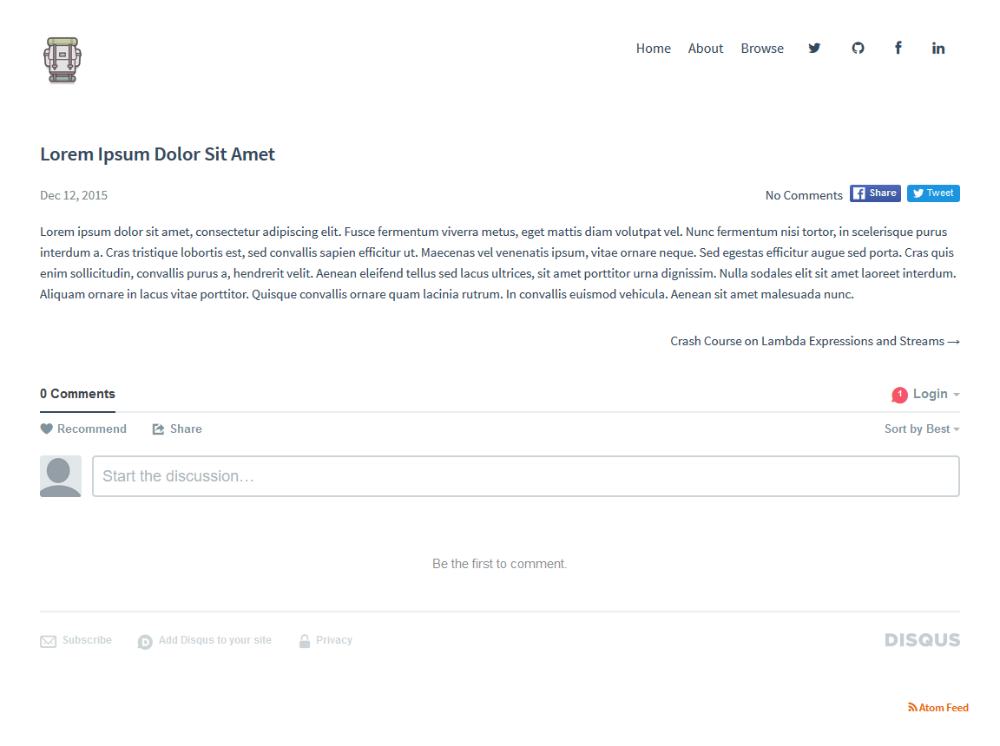

This is a modified version of the [Apollo](https://github.com/pinggod/hexo-theme-apollo) theme for [Hexo](https://github.com/hexo/hexo)

## Building
To build the theme, make sure to install the NPM dependencies using `npm install` and then run `gulp`.

```
npm install
gulp
```

## Installing
The suggested method for installing Hexo themes is to clone their repositories under the `themes/` folder of a Hexo website, but this causes a massive slow down on the startup time of the Hexo server because it tries to index everything under the theme's own `node_modules` folder.

My solution is to instead clone the theme repository into a whole separate folder (outside of the Hexo installation), place an empty folder with the theme's name under the `themes/` folder (in this case, `themes/yg-apollo`) and simply create symbolic links to the following files and folders:

*Folders*
- `layout`
- `source`

*Files*
- `_config.yml`

This ensures that Hexo indexes only the necessary files, allowing both Hexo's `hexo server` command and the theme's `gulp` (and their watchers) to run simultaneously, therefore speeding up the development process.

Once the symbolic links are set up, simply edit your Hexo installation's `_config.yml` and set the `theme` parameter as `yg-apollo`.

## Added Features and Functionality
- [404](layout/404.jade), [Archive](layout/archive.jade), [Tag](layout/tag.jade) and [Browse](layout/browse.jade) pages
- [Font Awesome](https://github.com/FortAwesome/Font-Awesome)-based icon support for main menu
- An atom feed link in the footer
- Tweet and Share buttons for Twitter and Facebook
- Variable-based SASS rules
- Reduced blank spaces and a larger content area (1080px wide as opposed to 700px)
- Larger clickable areas for main menu items
- Self-hosted fonts
- English documentation and pagination handles
- Optional [MathJax](https://mathjax.org/) support (as opposed to always-enabled)

## License
MIT
